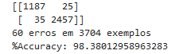

# Classification of dogs and cats using CNN
### Objectivce
#### 1. Binary classification between dogs and cats
#### 2. Multi-class classification between dog and cat breads

1. Initially it was created a neural network using manual layers.
2. Then use pre-trained models and apply them to the current problem.
3. Apply transfer-learning.

The best resulting classification in the binary problem is:

<table>
  <tr>
    <td></td>
</tr>
  <tr>
    <td style="text-align: center;"><em>1. confusion matrix for best results for binary classification</em></td>
  </tr>
</table>

The best classification confusion matrix in the multiclass problem with 84.5% accuracy is:

<table>
  <tr>
    <td></td>
</tr>
  <tr>
    <td style="text-align: center;"><em>1. confusion matrix for best results for multiclass classification</em></td>
  </tr>
</table>